# Recording your Independent Training runs — quick guide

Capture the results of an Independent Training (IT) run as a JSON file,
and (optionally) auto-upload it to the community dashboard at
[training.umaladder.moe](https://training.umaladder.moe).

There are two capture tools. **Pick the one that matches your setup:**

| Your setup | Download this file |
|---|---|
| Windows Steam (no Hachimi) | **`uma-it-extract.exe`** — from the [latest release](https://github.com/Acrith/uma-it-optimizer/releases/latest) |
| Hachimi-Edge user | **`uma_it_plugin.dll`** — from the newest [`hachimi-v*` release](https://github.com/Acrith/uma-it-optimizer/releases) |

The two tools ship as **separate releases** on the same
[Releases page](https://github.com/Acrith/uma-it-optimizer/releases):
numbered `v0.1.x` releases carry the extractor (GitHub marks the newest
one *Latest*), while `hachimi-v*` releases carry the plugin. Open the
right release and download the file from its **Assets** section.

| 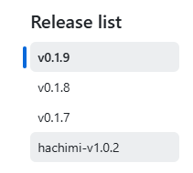 | 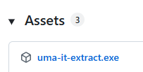 | 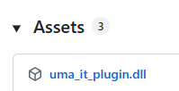 |
|---|---|---|
| Both release lines, side by side | `v0.1.x` → Assets | `hachimi-v*` → Assets |

---

## Step 0 — Unblock the downloaded file (both tools)

Windows marks files downloaded from the internet as blocked, which can
silently stop them from running or loading. Before anything else:

1. Right-click the downloaded file → **Properties**
2. At the bottom of the **General** tab, tick **Unblock**
3. Click **OK**

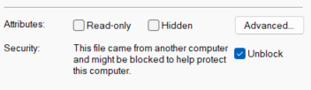

If you don't see the Unblock checkbox, the file is already fine — carry on.

---

## Option A — Windows Steam: `uma-it-extract.exe`

1. Put `uma-it-extract.exe` in a folder of its own (it creates a
   `runs/` folder and a small config file next to itself).
2. Play Umamusume normally. Finish an Independent Training run and stay
   on the **Training Log** pop-up (the screen right after IT finishes,
   before you press OK — any tab is fine).

   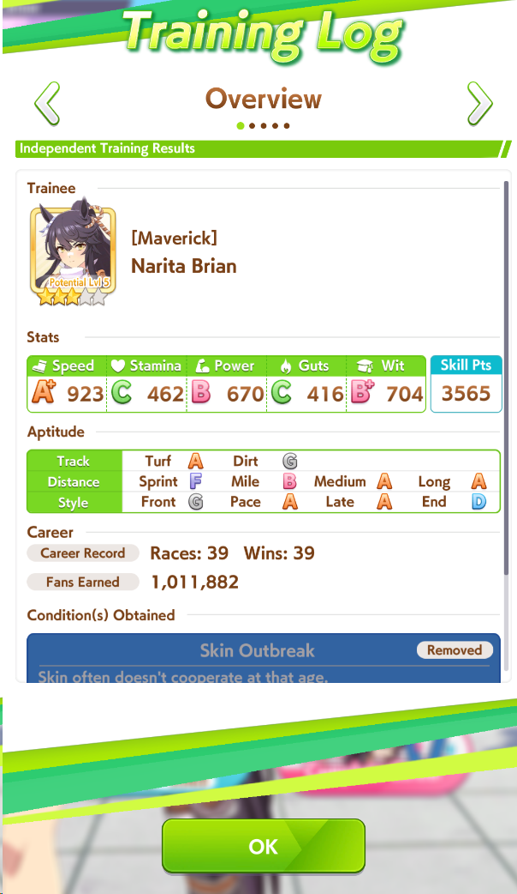

3. Double-click **`uma-it-extract.exe`**.
4. **First run only:** a short setup asks whether you want auto-upload.
   - **Y** → it shows the token page URL; sign in, create a token
     ([Getting an upload token](#getting-an-upload-token)) and paste it
     in. Every future run then uploads automatically.
   - **n** → local-only mode, nothing ever leaves your PC.

   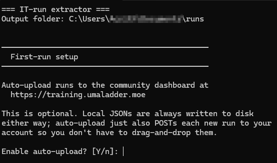

5. Wait a few seconds. Your run appears as
   `runs/<timestamp>_scen<N>_uma<N>.json` — ready to upload by hand,
   or already on the website if auto-upload is on.

   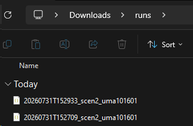

**Tip:** if the game isn't running yet, the extractor waits up to
5 minutes for you to launch it and reach a Training Log.

**Playing on Linux (Steam + Proton)?** Same tool, same output — just
launched from the terminal instead of double-clicked. Follow the
[Linux section of the extractor README](../tools/memory_extractor/README.md#for-linux-players-steam--proton).

---

## Option B — Hachimi: `uma_it_plugin.dll`

You need Hachimi-Edge already installed and working (if translations
work, you're good).

1. Put **`uma_it_plugin.dll`** in the game folder, next to
   `UmamusumePrettyDerby.exe` — the same place your Hachimi DLL lives:

   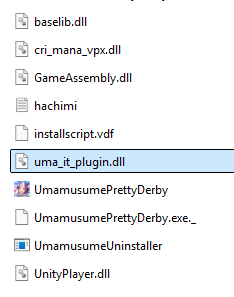

2. Open `<game folder>/hachimi/config.json` and add the plugin to the
   top-level `load_libraries` array:

   ```json
   "load_libraries": ["uma_it_plugin.dll"],
   ```

   (If the array already has entries, just add ours to it.)

3. Launch the game and open the Hachimi menu. If everything is in
   place, a **Plugins** section shows up with the plugin's controls:

   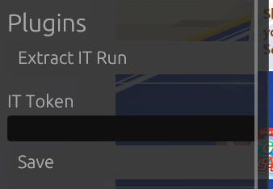

4. **Optional — auto-upload:** paste your token into **IT Token** and
   press **Save** ([Getting an upload token](#getting-an-upload-token)
   below). Leave it empty for local-only capture.

5. Finish an Independent Training run and stay on the **Training Log**
   pop-up. Open the Hachimi menu and click **Extract IT Run**. A brief
   (~50 ms) stutter on click is normal.

6. The run is saved to `<game folder>/hachimi/IT/` as
   `<timestamp>_scen<N>_uma<N>.json` — and if a token is set, it's
   uploaded to the website automatically. The local file is always
   written first, so a failed upload never loses a run.

---

## Getting an upload token

Both tools use the same token. On
[training.umaladder.moe](https://training.umaladder.moe), sign in with
Discord, open **API tokens** in the sidebar, give the token a name
(e.g. *desktop*) and click **Create token**.

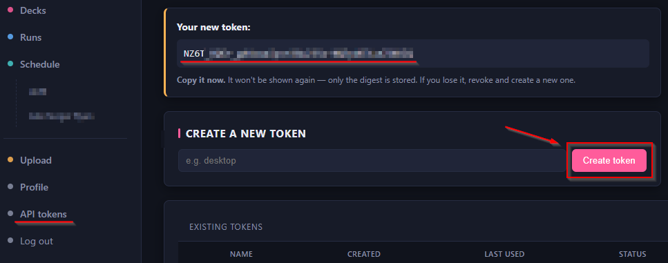

**Copy the token right away** — it's shown only once, then only its
digest is stored. Lost it? Revoke it and create a new one.

---

## What an uploaded run looks like

Whichever tool you use, an uploaded run gets its own page on the
dashboard — stats, per-card contributions, skill hints, races and
lineage, with a share link.

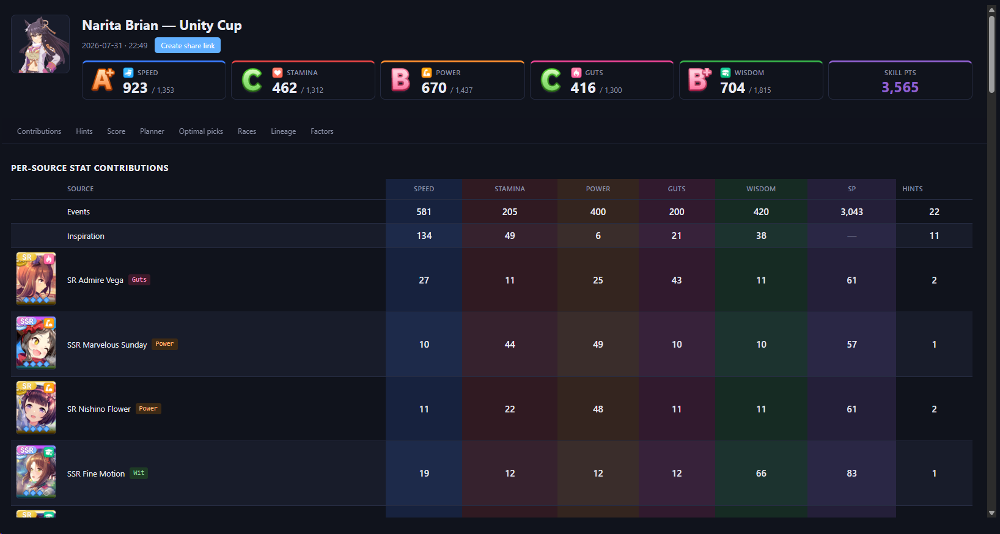

---

## Quick troubleshooting

- **Nothing happens / plugin panel missing** → re-check Step 0
  (Unblock) and, for Hachimi, that the DLL name appears in the
  top-level `load_libraries` array exactly as `uma_it_plugin.dll`.
- **Extractor says it found nothing** → make sure the Training Log
  pop-up is actually open when you run it.
- **Changed your mind about auto-upload?** Extractor: edit
  `uma-it-config.json` next to the exe (empty `api_token` = off).
  Hachimi: clear or fill **IT Token** and press **Save**.
